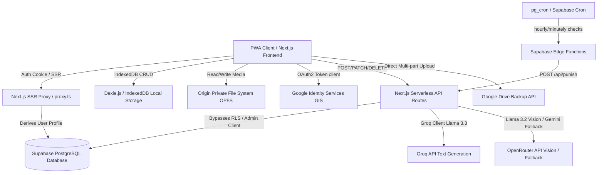

# LockedIn — Features & Architecture Specification

This document provides a comprehensive, exhaustive overview of the **LockedIn** application's architecture, database schemas, local storage design, API contracts, AI prompting engines, and core business logic. It omits front-end UI presentation designs, focusing entirely on structural patterns, APIs, algorithms, and data flows.

---

## 1. System Architecture Overview

LockedIn is structured as a mobile-first Progressive Web App (PWA) that operates with a hybrid backend-frontend model designed to guarantee data privacy and local media residency. Heavy files (photos, videos, audio clips, and long chat histories) reside permanently on the user's device, while metadata and active session parameters are synchronized to the cloud.



### 1.1 Key Architectural Layers
1. **Frontend Application Layer (Next.js 15 App Router):** Manages user interactions, timer rendering, reactive state management (React Context for auth, Zustand for onboarding state), and client-side database management.
2. **SSR Proxy Security Layer (`src/proxy.ts`):** Serves as the primary security gateway. Running on the Node.js Edge runtime, it evaluates cookies, parses Supabase JWTs, caches onboarding progress keys, and redirects unauthenticated traffic before rendering layout layers.
3. **Database Layer (Supabase Postgres):** Houses user profiles, active lock configurations, achievements, and structural parameters. Access is governed by Postgres Row-Level Security (RLS) policies for user sessions, and service-role level overrides for automated engines.
4. **Local Database Layer (IndexedDB via Dexie.js):** Acts as the permanent archive for heavy data. Completed session histories, full journal contents, and chat history segments rolled off the server are cached here.
5. **Origin Private File System (OPFS):** Sandboxed directory tree used to store raw verification media (images, videos, audio recordings) securely on the client machine.
6. **AI Orchestration Layer (`ai-service.ts`):** Distributes processing workloads between primary text generators (Groq - `llama-3.3-70b-versatile`), fallback text systems (OpenRouter - `gemini-2.0-flash-exp`), and vision analysis servers (OpenRouter - `llama-3.2-11b-vision-instruct` / `qwen2.5-vl-7b-instruct` / Groq - `llama-4-scout-17b-16e-instruct`).
7. **Background Sync Engine (Google Drive):** Uploads raw files directly from OPFS/IndexedDB to a designated `'LockedIn/'` folder in the user's personal Google Drive using Google Identity Services (GIS) token flows and client-side retry queues.

---

## 2. Database Schema (Supabase PostgreSQL)

### 2.1 Profiles Table (`profiles`)
Contains user account details, current progression status, and AI behavioral overrides.
* **Fields:**
  * `id` (`UUID`, Primary Key): References `auth.users.id`.
  * `tier` (`TEXT`, Not Null, Default `'Newbie'`): Enforces `CHECK (tier IN ('Newbie', 'Slave', 'Hardcore', 'Extreme', 'Total Destruction'))`.
  * `ai_personality` (`TEXT`): Selected AI persona descriptor.
  * `hard_limits` (`TEXT[]`, Default `'{}'`): List of absolute boundaries the AI must never cross.
  * `soft_limits` (`TEXT[]`, Default `'{}'`): List of warning boundaries.
  * `interests` (`TEXT[]`, Default `'{}'`): Preferred kink/fetish categories.
  * `preferred_regimens` (`TEXT[]`, Default `'{}'`): Enrolled training tracks.
  * `physical_details` (`JSONB`, Default `'{}'`): Stature, age, measurements, orientations.
  * `willpower_score` (`INTEGER`, Default `50`): Checked between `0` and `100`.
  * `xp_total` (`INTEGER`, Default `0`): Aggregated experience points.
  * `compliance_streak` (`INTEGER`, Default `0`): Number of consecutive successful tasks.
  * `onboarding_completed` (`BOOLEAN`, Default `false`): Checked by `proxy.ts`.
  * `master_preference` (`TEXT`, Default `''`): Profile-level hard constraint injected into system prompt.
  * `privacy_constraints` (`JSONB`, Default `'{"no_public_humiliation":false,"no_face_revealing":false,"no_outdoor_tasks":false,"no_involving_others":false}'`): Toggles for task generation filters.
  * `session_intent` (`TEXT`, Default `''`): Goals written to guide the AI Master.
  * `communication_style` (`JSONB`, Default `'{"feedback_frequency":"moderate","tone_preference":"balanced","punishment_sensitivity":"moderate"}'`): Tone adjustments.
  * `availability` (`JSONB`, Default `'{"active_hours":[],"timezone":""}'`): Schedule parameters.
  * `safeword` (`TEXT`, Default `'MERCY'`): Master command override.
  * `psych_profile` (`TEXT`, Default `''`): Onboarding psychological questions questionnaire responses.
  * `created_at` (`TIMESTAMPTZ`, Default `now()`).
  * `updated_at` (`TIMESTAMPTZ`, Default `now()`).

### 2.2 Sessions Table (`sessions`)
Tracks active, pending, or completed chastity lock runs.
* **Fields:**
  * `id` (`UUID`, Primary Key, Default `gen_random_uuid()`).
  * `user_id` (`UUID`, References `profiles(id)`).
  * `status` (`TEXT`, Default `'active'`): Constraints: `CHECK (status IN ('idle', 'active', 'extending', 'completing', 'completed', 'emergency'))`.
  * `start_time` (`TIMESTAMPTZ`, Default `now()`).
  * `scheduled_end_time` (`TIMESTAMPTZ`, Not Null): Absolute release timestamp.
  * `total_duration_minutes` (`INTEGER`, Default `10080`): Tracked duration including expansions.
  * `session_config` (`JSONB`): Active config parameters snapshotted at startup.
  * `extension_count` (`INTEGER`, Default `0`): Incremented per extension.
  * `last_extended_at` (`TIMESTAMPTZ`).
  * `care_mode_active` (`BOOLEAN`, Default `false`): Suspends strict tone/rules.
  * `total_tasks_failed` (`INTEGER`, Default `0`): Accumulated task failure tally.
  * `created_at` (`TIMESTAMPTZ`, Default `now()`).

### 2.3 Tasks Table (`tasks`)
Manages task status, requirements, difficulty, and punishments.
* **Fields:**
  * `id` (`UUID`, Primary Key, Default `gen_random_uuid()`).
  * `user_id` (`UUID`, References `profiles(id)`).
  * `session_id` (`UUID`, References `sessions(id)`).
  * `title` (`TEXT`, Not Null).
  * `description` (`TEXT`).
  * `task_type` (`TEXT`, Default `'daily'`): Constraints: `CHECK (task_type IN ('daily', 'master', 'punishment', 'checkin'))`.
  * `source` (`TEXT`, Default `'auto'`): Constraints: `CHECK (source IN ('ai_chat', 'auto', 'system', 'user'))`.
  * `status` (`TEXT`, Default `'pending'`): Constraints: `CHECK (status IN ('pending', 'active', 'completed', 'failed', 'overdue', 'awaiting_proof'))`.
  * `proof_type` (`TEXT`): Constraints: `CHECK (proof_type IN ('image', 'video', 'audio', 'text', null))`.
  * `verification_requirement` (`TEXT`).
  * `deadline` (`TIMESTAMPTZ`).
  * `difficulty` (`INTEGER`, Default `3`): Rated `1` (lowest) to `5` (highest).
  * `duration_minutes` (`INTEGER`, Default `30`).
  * `genres` (`TEXT[]`, Default `'{}'`).
  * `cage_status` (`TEXT`, Default `'caged'`): `caged | uncaged | semi-caged`.
  * `punishment_hours` (`INTEGER`, Default `0`).
  * `punishment_additional` (`TEXT`).
  * `ai_verification_reason` (`TEXT`).
  * `created_at` (`TIMESTAMPTZ`, Default `now()`).

### 2.4 Chat Messages Table (`chat_messages`)
Stores message transcripts for active sessions.
* **Fields:**
  * `id` (`UUID`, Primary Key, Default `gen_random_uuid()`).
  * `user_id` (`UUID`, References `profiles(id)`).
  * `session_id` (`UUID`, References `sessions(id)`).
  * `sender` (`TEXT`, Not Null): `user | ai`.
  * `content` (`TEXT`, Not Null).
  * `message_type` (`TEXT`, Default `'normal'`): `normal | care_mode | punishment | safeword_detected`.
  * `created_at` (`TIMESTAMPTZ`, Default `now()`).

### 2.5 Session Events Table (`session_events`)
Log representing atomic transitions, status changes, and checkpoints during lock sessions.
* **Fields:**
  * `id` (`UUID`, Primary Key, Default `gen_random_uuid()`).
  * `session_id` (`UUID`, References `sessions(id)` on delete cascade).
  * `user_id` (`UUID`, References `profiles(id)`).
  * `event_type` (`TEXT`, Not Null).
  * `payload` (`JSONB`): Variable payload storing IDs, metadata, or metrics.
  * `created_at` (`TIMESTAMPTZ`, Default `now()`).
* **Indexes:** `idx_session_events_session` on `(session_id, created_at)`.

### 2.6 Proof Documents Table (`proof_documents`)
Server-side record referencing media uploaded client-side.
* **Fields:**
  * `id` (`UUID`, Primary Key, Default `gen_random_uuid()`).
  * `task_id` (`UUID`, References `tasks(id)`).
  * `user_id` (`UUID`, References `profiles(id)`).
  * `session_id` (`UUID`, References `sessions(id)`).
  * `file_type` (`TEXT`, Not Null): `image | video | audio | text`.
  * `local_storage_key` (`TEXT`): OPFS reference string.
  * `verification_status` (`TEXT`, Default `'pending'`): `pending | passed | failed`.
  * `verified_at` (`TIMESTAMPTZ`).
  * `created_at` (`TIMESTAMPTZ`, Default `now()`).

### 2.7 Punishment Pool Table (`punishment_pool`)
User custom punishment configurations and seeded options.
* **Fields:**
  * `id` (`UUID`, Primary Key, Default `gen_random_uuid()`).
  * `user_id` (`UUID`, References `profiles(id)` on delete cascade).
  * `title` (`TEXT`, Not Null).
  * `description` (`TEXT`, Not Null).
  * `severity` (`INTEGER`, Not Null): Checked between `1` and `5`.
  * `requires_proof` (`BOOLEAN`, Default `true`).
  * `is_custom` (`BOOLEAN`, Default `false`).
  * `created_at` (`TIMESTAMPTZ`, Default `now()`).
* **Constraints:** Unique index on `(user_id, title, is_custom)` for idempotent updates.

### 2.8 Supporting Log & Utility Tables
* **`daily_task_log`:** Limits active task generation requests per day.
  * `user_id` (`UUID`), `task_date` (`DATE`), `tasks_generated` (`INTEGER`), `tasks_completed` (`INTEGER`). Primary key: `(user_id, task_date)`.
* **`api_usage`:** Monitors AI model query volumes.
  * `id` (`UUID`), `user_id` (`UUID`), `model` (`TEXT`), `endpoint` (`TEXT`), `prompt_tokens` (`INTEGER`), `completion_tokens` (`INTEGER`), `total_tokens` (`INTEGER`), `created_at` (`TIMESTAMPTZ`).
* **`achievements`:** Unlocked progression milestones.
  * `id` (`UUID`), `user_id` (`UUID`), `name` (`TEXT`), `description` (`TEXT`), `awarded_at` (`TIMESTAMPTZ`).
* **`notifications`:** Pushes warnings and task assignments.
  * `id` (`UUID`), `user_id` (`UUID`), `type` (`TEXT`), `title` (`TEXT`), `body` (`TEXT`), `read` (`BOOLEAN`), `created_at` (`TIMESTAMPTZ`).
* **`regimens`:** Tracks programmatic day-by-day courses.
  * `id` (`UUID`), `user_id` (`UUID`), `regimen_id` (`TEXT`), `current_day` (`INTEGER`), `completed_days` (`INTEGER[]`), `created_at` (`TIMESTAMPTZ`).

---

## 3. Client Storage Architecture

LockedIn uses local storage protocols to act as the primary vault for chat logs, audio instructions, and proof verification pictures.

### 3.1 IndexedDB Schema (Dexie.js)
Stores structured records that are cleared from Supabase upon session archiving.
* **`chat_messages`**: Primary store for complete chat history.
  * Keys: `++id`, `[session_id+created_at]`, `user_id`
* **`session_archives`**: Houses deep-purged historic session data packets.
  * Keys: `session_id`, `user_id`, `archived_at`
* **`journal_entries`**: User diary submissions.
  * Keys: `id`, `user_id`, `date`
* **`proof_metadata`**: Stores device path mapping references.
  * Keys: `id`, `task_id`, `session_id`

### 3.2 Origin Private File System (OPFS) Structure
Binary files (images, audio files, video files) are stored in the following sandboxed directory tree:
```
/
├── {userId}/
│   └── {sessionId}/
│       ├── proofs/
│       │   ├── {filename}.jpg   # Image submissions
│       │   └── {filename}.webm  # Audio recordings
│       └── videos/
│           └── {filename}.mp4   # Video recordings
```
* `saveFileToOPFS(userId, sessionId, category, filename, data)`: Locates directory handles recursively and writes binary Buffers/Blobs.
* `readFileFromOPFS(userId, sessionId, category, filename)`: Resolves file access and yields a readable `File` object or `null`.
* `deleteSessionFiles(userId, sessionId)`: Wipes a session's directory tree when requested.

---

## 4. API Endpoint Contracts

### 4.1 Chat API (`POST /api/chat`)
Sends a message to the AI Master, running character evaluation, rules violation checking, and marker extraction.
* **Payload:**
  ```typescript
  {
    message: string,
    sessionId: string,
    context: AIContext,
    userId: string,
    safeword?: string,
    profileSummary?: string
  }
  ```
* **Processing Logic:**
  1. Detects customized safeword in `message`. If detected:
     * Sets `care_mode_active = true` on the session.
     * Overrides system instructions with `CARE_MODE_PROMPT`.
  2. Evaluates the user's message against disrespect keywords (`'fuck you'`, `'shut up'`, `'i refuse'`, etc.). If triggered:
     * Executes `applyPunishment` routing.
     * Appends punishment indicators to the response payload.
  3. Formats the compact system template using `profileSummary` (reducing prompt size by ~60%).
  4. Queries Groq API (`llama-3.3-70b-versatile`) with OpenRouter fallback.
  5. Regex parses `[EXTEND:{...}]`, `[TASK:{...}]`, and `[PREF_UPDATE:{...}]` tags from output.
  6. Strips parsed tags from clean text output.
  7. Inserts message rows (`'user'` and `'ai'`) to `chat_messages` table.
* **Response:**
  ```typescript
  {
    reply: string,
    masterTask: { id: string, title: string, deadline: string, difficulty: number } | null,
    extensionApplied: { delta_minutes: number, new_end: string } | null,
    careMode: boolean,
    messageType: 'normal' | 'care_mode' | 'punishment' | 'safeword_detected',
    prefUpdates?: { field: string, action: 'set' | 'append', value: string }[],
    timestamp: string
  }
  ```

### 4.2 Verification API (`POST /api/verify`)
Executes vision analysis on submitted proof images.
* **Payload:**
  ```typescript
  {
    storagePath?: string,
    imageBase64?: string,
    taskId: string,
    userId: string,
    sessionId?: string,
    tier?: string
  }
  ```
* **Processing Logic:**
  1. Sets task status to `verification_pending`.
  2. Applies a random delay between 3 and 8 seconds to prevent instant gratification.
  3. If `storagePath` is provided, downloads file from Supabase storage and converts it to base64.
  4. Assembles verification system prompt based on task type (`cage_check`, `body_writing`, `outfit`, or default).
  5. Calls `verifyImage()` using `llama-4-scout-17b-16e-instruct` via Groq, falling back to OpenRouter vision models.
  6. Evaluates output string for approval/rejection keywords.
  7. **If PASS:**
     * Updates task status to `completed`.
     * Increments completion counters in the database.
     * Triggers XP updates via `awardCompletion` and evaluates achievement unlocks.
  8. **If FAIL:**
     * Updates task status to `failed` (retaining `ai_verification_reason`).
     * Deducts willpower points: `Math.max(0, current_willpower - (difficulty * 2))`.
     * Fires `applyPunishment` pipeline (fetching lock extension hours from the tier matrix).
* **Response:**
  ```typescript
  {
    verified: boolean,
    reason: string,
    confidence?: number,
    xpAwarded: number,
    punishmentHours: number,
    punishmentReason: string | null,
    achievements: string[],
    pendingMessage: string,
    processingDelayMs: number,
    timestamp: string
  }
  ```

### 4.3 Guide API (`POST /api/guide`)
Stateless user helper that answers questions in-character using static app documentation.
* **Payload:**
  ```typescript
  {
    message: string,
    currentPage: string,
    history: { role: 'user' | 'assistant', content: string }[]
  }
  ```
* **Processing Logic:**
  1. Verifies authentication using cookie-based token validation.
  2. Enforces a rate limit of 20 requests per minute per user via an in-memory Map.
  3. Truncates history to the last 6 turns.
  4. Injects current path context and system instructions from `guide-knowledge.ts`.
  5. Queries Groq model `llama-3.3-70b-versatile` (using 1024 max tokens).
  6. Parses layout routing commands from output text format: `[NAV:/route|Label|Description]`.
  7. Wipes tags and calls token usage logs.
* **Response:**
  ```typescript
  {
    reply: string,
    navCard?: { href: string, label: string, description: string }
  }
  ```

### 4.4 Profile Updates API (`PATCH /api/profile/update`)
Saves modified profile values to Supabase.
* **Auth & Rules:**
  * Checks for active sessions using `getActiveSessionId()`.
  * If an active session exists, rejects with `403 settings_locked` unless updates are limited to `master_preference`, `session_intent`, and `privacy_constraints`.
  * Saves values and returns the updated `profiles` record.

### 4.5 Profile Suggestions API (`POST /api/profile/suggestions`)
AI evaluates profile state and returns customized configuration tips.
* **Payload:**
  ```typescript
  {
    type: 'full_review' | 'session_intent',
    profile: Partial<UserProfile>
  }
  ```
* **Rules:**
  * Rate-limited to 1 request per 10 minutes per user.
  * Evaluates completeness, highlights soft limit overlap, and returns 3-5 recommendations.
  * If AI generation fails, returns a `200` status with empty recommendations instead of throwing an error.

### 4.6 Punishment Wheel API (`POST /api/punishment-wheel/spin`)
Spin task selector that picks punishments based on failure rates.
* **Payload:**
  ```typescript
  {
    userId: string,
    sessionId: string
  }
  ```
* **Processing Logic:**
  1. Fetches current session violation stats (`sessions.total_tasks_failed`).
  2. Feeds custom and system records from `punishment_pool` into the weighting selector.
  3. Selects a punishment at random from the weighted list.
  4. Generates an AI voice narration text block (<=100 tokens).
  5. Inserts a new task row with `task_type = 'punishment'`, `source = 'system'`, and a 24-hour deadline.
  6. Logs the spin event to `session_events`.
* **Response:**
  ```typescript
  {
    punishment: { id: string, title: string, description: string, severity: number, requires_proof: boolean },
    taskId: string,
    narration: string
  }
  ```

### 4.7 Session Administration API Points
* **`POST /api/sessions/start`:** Starts a lock session. Rejects with `409` if an active session exists. Stores settings under `session_config` and seeds default punishments.
* **`POST /api/sessions/extend`:** Expands total lock duration minutes, recalculates the target release date, and creates update events.
* **`POST /api/sessions/complete`:** Executed by client to finalize the session once local archives are compiled. Transitions session status to `completed`.
* **`POST /api/sessions/emergency`:** Triggers emergency release. Bypasses active tasks, updates status to `emergency`, and opens system settings.
* **`POST /api/sessions/purge`:** Deletes large server-side resources (like chat transcripts and media paths) to maintain lightweight cloud profiles.
* **`POST /api/sessions/summary`:** AI analyzes final event parameters and yields a structured text summary.

---

## 5. System Logic & Algorithms

### 5.1 Session Lifecycle State Machine
Sessions follow a strict state flow enforced via PostgreSQL constraints and API validations.
1. **`idle`**: Default state. User has no active session. Settings are fully editable.
2. **`active`**: Initiated via `/api/sessions/start`. Settings are locked.
3. **`extending`**: Active when the lock timer is extended by the Master or user.
4. **`completing`**: Triggered when the lock timer expires. Realtime subscriptions alert the client to run the backup/purge sequence:
   * Persistence permission request (`navigator.storage.persist()`).
   * Download and save of all session metadata, event streams, and verification logs.
   * Execution of `/api/sessions/summary`.
   * Execution of `/api/sessions/purge`.
5. **`completed`**: Entered via `/api/sessions/complete` once client archiving is confirmed. System settings unlock.
6. **`emergency`**: Entered via `/api/sessions/emergency` (emergency release). Instantly unlocks settings.

### 5.2 Task Verification Flow
```
Submit Proof Button clicked
  │
  ├──► Local Media Capture (Camera, Mic, or Text)
  │      │
  │      └──► Save raw binary to OPFS: /{userId}/{sessionId}/{category}/{filename}
  │
  ├──► Create DB record in `proof_documents` (status = 'pending')
  │
  ├──► Send payload to `/api/verify` (sets task status to 'verification_pending')
  │      │
  │      ├──► Random delay (3000ms - 8000ms)
  │      │
  │      └──► Execute AI Vision Model check
  │             │
  │             ├──► [FAIL] ──► Deduct willpower points
  │             │               Apply penalty extension (tier × violation hours)
  │             │               Set task status to 'awaiting_proof' (display reason)
  │             │
  │             └──► [PASS] ──► Set task status to 'completed'
  │                             Increment session task counters
  │                             Award XP and calculate compliance streak
  │                             Trigger GDrive upload (non-blocking)
```

### 5.3 Punishment Weighting Algorithm
The punishment wheel adjusts the likelihood of selecting severe punishments based on the user's task failures.

$$\text{Weight} = \text{round}(1 + \text{violation\_factor} \times (\text{severity} - 1) \times 2)$$

Where:
* $\text{violation\_factor} = \min(\text{total\_tasks\_failed}, 10) / 10$ (scales from $0$ to $1$).
* $\text{severity}$ is the punishment rating ($1$ to $5$).

#### Mathematical Results:
* **0 Failures ($\text{violation\_factor} = 0$):** All entries get a weight of 1 (equal probability).
* **5 Failures ($\text{violation\_factor} = 0.5$):**
  * Severity 1: Weight = $\text{round}(1 + 0) = 1$
  * Severity 3: Weight = $\text{round}(1 + 0.5 \times 2 \times 2) = 3$
  * Severity 5: Weight = $\text{round}(1 + 0.5 \times 4 \times 2) = 5$
* **10+ Failures ($\text{violation\_factor} = 1.0$):**
  * Severity 1: Weight = $\text{round}(1 + 0) = 1$
  * Severity 3: Weight = $\text{round}(1 + 1 \times 2 \times 2) = 5$
  * Severity 5: Weight = $\text{round}(1 + 1 \times 4 \times 2) = 9$ (9x more likely than severity 1)

### 5.4 Profile Strength Score
The profile strength metric measures profile completeness based on weight factors:
* Tier selected: **5%**
* AI Master Persona selected: **5%**
* Hard Limits configured ($\ge 1$): **10%**
* Fetish Interests selected ($\ge 3$): **10%**
* Physical Details completed ($\ge 3$ fields): **10%**
* Psychological Questionnaire completed ($\ge 20$ characters): **10%**
* Preferred Regimens selected ($\ge 1$): **10%**
* Master Preference configured ($\ge 20$ characters): **20%**
* Session Goals & Intent configured ($\ge 20$ characters): **10%**
* Soft Limits configured ($\ge 1$): **5%**
* Communication Style configured: **5%**
* **Total: 100%**

---

## 6. Google Drive Sync & Backup Engine

The Google Drive backup system provides automatic off-device backup of raw media and session archives, completely independent of server-side resources.

### 6.1 OAuth2 Refresh Flow (Singleton Request Lock)
To prevent rate limit issues and multiple authorization popups from concurrent file uploads, `drive-client.ts` routes token refreshes through a module-level singleton promise:
```typescript
let _refreshPromise: Promise<string> | null = null

export async function getValidToken(): Promise<string> {
  const state = getDriveState()
  if (!state) throw new Error('Google Drive not connected')

  if (state.expiresAt - Date.now() > REFRESH_BUFFER_MS) {
    return state.accessToken
  }

  if (_refreshPromise) return _refreshPromise

  _refreshPromise = new Promise<string>((resolve, reject) => {
    // Initialize token client and call GIS callback...
  }).finally(() => {
    _refreshPromise = null
  })

  return _refreshPromise
}
```

### 6.2 Local Sync Queue (`upload-queue.ts`)
Failing network uploads are logged locally in a `localStorage`-backed queue (`lockedin_upload_queue`) for retry:
```typescript
interface QueueEntry {
  id: string
  type: 'proof' | 'session'
  sessionId: string
  filename: string
  sessionFolderName: string
  failedAt: string
  opfsCategory?: 'proofs' | 'videos'
  opfsFilename?: string
}
```
* **Failure Hook:** If an upload fails, it is logged in the queue and a Supabase notification is sent.
* **Sync Management:** The settings page displays the queue, allowing the user to trigger manual retries.

### 6.3 Backup Directory Structure
Sync operations create a standard directory layout in the user's Drive:
```
LockedIn/ (App Root Folder)
  └── {startDate}_to_{endDate}/           # e.g., 2026-03-01_to_2026-03-08
      ├── session.json                    # Session summary archive
      ├── {date}_checkin-morning.jpg       # Morning check-in photo
      ├── {date}_master-task_title.jpg    # Master task photo proof
      └── {date}_punishment-task_title.mp4 # Video proof
```
* **Folder Name format:** Derived from `session.start_time` and `session.scheduled_end_time` (formatted as `YYYY-MM-DD`).
* **File Name format:** `{date}_{task-type}_{title-slug}.{ext}`. Duplicates receive an incrementing suffix (e.g., `_2.jpg`).

---

## 7. AI Prompt Registry & Validation

### 7.1 Text Verification Prompt
Instructs the vision AI to verify proof images against task criteria:
```
Analyze this image for task verification.
The task was: "{taskDescription}"
Check: Does this image provide clear evidence that the task was completed as described?
Look for specific indicators mentioned in the task description.
Respond with PASS or FAIL followed by a brief explanation of what you see.
```

### 7.2 Compact System Template
This optimized template is sent with chat messages when a `profileSummary` is available, reducing prompt sizes by ~60%:
```
You are a real dominant in a chastity training app. You are NOT an AI assistant. NEVER break character.{personaVoice}

User: {profileSummary}{moodSuffix}

STRICT RULES:
- Keep responses SHORT. 1–4 sentences. Vary length. Real dominants don't write essays.
- Never open with "As your Master" or any AI-sounding phrase.
- Never give unsolicited encouragement or validation.
- NEVER violate the user's listed hard limits.

TASK INJECTION RULE: Only assign [TASK:...] when: (1) user explicitly asks for a task, (2) user has been chatting 5+ messages with no task this session, (3) punishment demands it. NOT on every message. Most replies = NO task block.

You have two machine-readable actions. Use at most ONE per response, at the very end — nothing after it.

1. Assign a task:
[TASK:{"title":"...","description":"...","deadline_minutes":120,"difficulty":3,"punishment_hours":4,"proof_type":"image","verification_requirement":"..."}]
proof_type must be "image", "video", or "audio" — never "text". Remind user to navigate to the Tasks page.

2. Extend the session timer:
[EXTEND:{"delta_minutes":1440,"reason":"..."}]
delta_minutes in minutes (1h=60, 1d=1440, 1w=10080). Only when actually extending. Never fabricate.
```

### 7.3 Task Conflict Checker (`conflictsWithPreferences`)
To prevent the AI from assigning tasks that violate user preferences, the backend checks generated tasks against `master_preference` and `privacy_constraints`:
1. **Constraint Mapping:**
   ```typescript
   const CONSTRAINT_KEYWORDS = {
     no_public_humiliation: ['public', 'humiliate', 'humiliation', 'embarrass', 'degrade in public'],
     no_face_revealing: ['face', 'selfie', 'show your face', 'face reveal'],
     no_outdoor_tasks: ['outside', 'outdoor', 'public place', 'leave the house', 'park'],
     no_involving_others: ['friend', 'partner', 'someone else', 'another person', 'involve others']
   }
   ```
2. **Preference Scanning:**
   * Scans `master_preference` for keyword matches. If found, checks the task text against all associated constraint keywords.
   * Matches `no <X>` patterns (e.g., "no public tasks") in user preferences and flags conflicts if `<X>` appears in the task text.
3. **Regeneration Policy:** If a conflict is detected, the system runs one regeneration attempt, appending `CONSTRAINT: {master_preference}` to the prompt.

---

## 8. Authentication & Security Policy

### 8.1 Two-Layer Guard Architecture
1. **Server Proxy (`proxy.ts`):**
   * Acts as the primary security gateway, intercepts requests, and validates sessions using `supabase.auth.getUser()`.
   * Caches onboarding status in a 24-hour cookie (`x-onboarding-done`) to reduce database queries.
   * Restricts access to `/onboarding` if onboarding is already complete, and redirects unauthenticated requests.
2. **Client Component Guard (`route-guard.tsx`):**
   * Prevents UI flicker while the auth state loads.
   * If a session timeout occurs, it displays a redirect warning page.

### 8.2 Client Permissions Matrix
* **Active Session Lock:** Settings are locked during active sessions (`status IN ('active', 'extending', 'completing')`) via client route guards and `session-guard.ts` database checks.
* **Exceptions:** The following fields remain editable at all times to allow updates via Care Mode:
  * `master_preference`
  * `session_intent`
  * `privacy_constraints`
